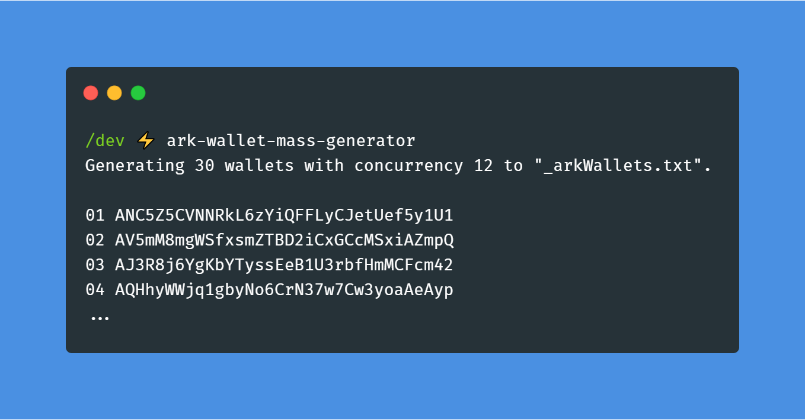

# my-cool-package-cli
[](https://travis-ci.com/rigwild/my-cool-package-cli) [](https://www.npmjs.com/package/my-cool-package-cli)  

> My fabulous module




## Install

```
$ yarn global add my-cool-package-cli
```

## Usage

```
$ my-cool-package-cli --help

  Usage
    $ my-cool-package
  
  Options
    --file -f         Output file [Default: "myFile.json"]

  Examples
    $ my-cool-package
    $ my-cool-package --file="_arkWallets.txt"

  https://github.com/rigwild/my-cool-package-cli
```


## Related

 - [my-cool-package](https://github.com/rigwild/my-cool-package) - API for this module


## License

[The MIT license](./LICENSE)
