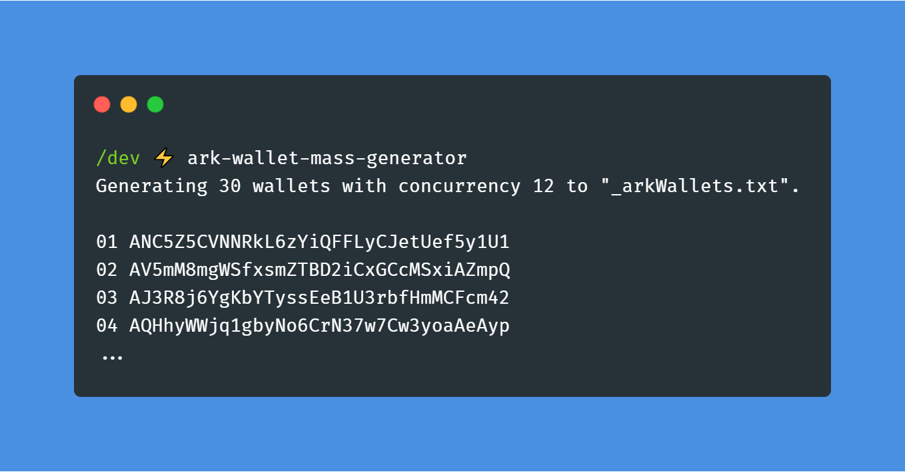

# my-cool-package
[](https://github.com/rigwild/my-cool-package/actions) [](https://www.npmjs.com/package/my-cool-package)  

> My stellar module




## Install

```
$ yarn add my-cool-package
```


## Usage

```js
import myCoolPackage from 'my-cool-package'

await myCoolPackage('unicorns')
//=> 'unicorns & rainbows'
```


## API

### myCoolPackage(input, options?)

#### input

Type: `string`

Lorem ipsum.

#### options

Type: `object`

##### foo

Type: `boolean`\
Default: `false`

Lorem ipsum.


## Related

 - [my-cool-package-cli](https://github.com/rigwild/my-cool-package-cli) - CLI for this module 


## License

[The MIT license](./LICENSE)
