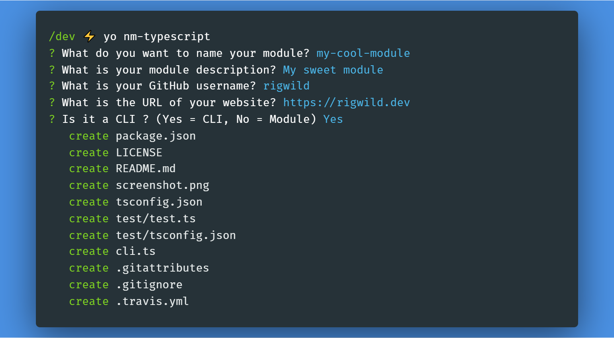

# generator-nm-typescript [](https://github.com/rigwild/generator-nm-typescript/actions)

> Scaffold out a [node module](https://github.com/sindresorhus/node-module-boilerplate)



Features and differences of this fork ([original generator `nm`](https://github.com/sindresorhus/generator-nm)):

 - **Fully reworked to TypeScript (AVA + TypeScript + ts-node)**
 - Use **Yarn**
 - Generate **a module OR a CLI (not both merged)**
 - Replaced Travis with **Github Actions**
 - Keep Yarn lock files
 - package.json engine to node >=10
 - Added Prettier configuration
 - Added lots of badges at the top of the README
 - Added `Related` section at the end of the README
 - Added README screenshot
 - Made LICENSE and README uppercase
 - CLI mode add [`update-notifier`](https://github.com/yeoman/update-notifier)
 - CLI mode GitHub repo link in help message
 - CLI mode import package having package name without `-cli` and show it in the README `Related` section
 - Removed .editorconfig/.npmrc
 - Removed xo/nyc/codecov
 - Set full website URL instead of humanized

## Generation examples

 - [Module generation example](./examples/module)
 - [CLI generation example](./examples/cli)

## Install

```
$ yarn global add yo generator-nm-typescript
```


## Usage

With [yo](https://github.com/yeoman/yo):

```
$ yo nm-typescript
```

There are multiple command-line options available:

```
$ yo nm-typescript --help

  Usage:
    yo nm-typescript [options]

  Options:
    --help          # Print the generator's options and usage
    --cli           # Make a CLI
    --no-cli        # Make a module
    --skip-cache    # Do not remember prompt answers                      Default: false
    --skip-install  # Do not automatically install dependencies           Default: false
```
